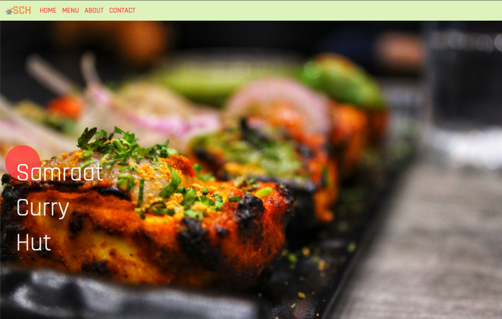

<!--
*** Thanks for checking out the Best-README-Template. If you have a suggestion
*** that would make this better, please fork the repo and create a pull request
*** or simply open an issue with the tag "enhancement".
*** Thanks again! Now go create something AMAZING! :D
-->


<!-- PROJECT SHIELDS -->
<!--
*** I'm using markdown "reference style" links for readability.
*** Reference links are enclosed in brackets [ ] instead of parentheses ( ).
*** See the bottom of this document for the declaration of the reference variables
*** for contributors-url, forks-url, etc. This is an optional, concise syntax you may use.
*** https://www.markdownguide.org/basic-syntax/#reference-style-links
-->

[](https://lbesson.mit-license.org/)


<!-- PROJECT LOGO -->
<br />
<p align="center">
  <a href="https://github.com/MooseandSquvirrel/samraat/tree/master/README.md">
    
  </a>

  <h3 align="center">Samraat Website</h3>

  <p align="center">
    A personal project website for a local indian food restaurant.
    <br />
    <a href="https://github.com/MooseandSquvirrel/samraat"><strong>Explore the docs »</strong></a>
    <br />
    <br />
    <a href="https://samraat-portfolio.herokuapp.com/">View Demo</a>
  </p>
</p>


<!-- TABLE OF CONTENTS -->
<details open="open">
  <summary>Table of Contents</summary>
  <ol>
    <li>
      <a href="#about-the-project">About The Project</a>
      <ul>
        <li><a href="#built-with">Built With</a></li>
      </ul>
    </li>
    <li>
      <a href="#getting-started">Getting Started</a>
      <ul>
        <li><a href="#prerequisites">Prerequisites</a></li>
        <li><a href="#installation">Installation</a></li>
      </ul>
    </li>
    <li><a href="#usage">Usage</a></li>
    <li><a href="#license">License</a></li>
    <li><a href="#contact">Contact</a></li>
    <li><a href="#acknowledgements">Acknowledgements</a></li>
  </ol>
</details>


<!-- ABOUT THE PROJECT -->
## About The Project



This website was a personal project to work on refamiliarizing myself with Bootstrap 4 and CSS3 after I took time to work on other projects in Python, Ruby, NodeJs and C. 

### Built With

* [HTML5](https://html.com/html5/) / [CSS3](https://developer.mozilla.org/en-US/docs/Web/CSS)
* [Bootstrap 4](https://getbootstrap.com/docs/4.4/getting-started/introduction/)


<!-- GETTING STARTED -->
## Getting Started

If you would like to use this site as a template for your restaurant or other project, feel free to download it!

### Prerequisites

* None
  ```sh
  N/A
  ```

### Installation

1. Clone the repo locally.
   ```sh
   git clone https://github.com/MooseandSquvirrel/samraat.git
   ```


<!-- USAGE EXAMPLES -->
## Usage

This project is meant for use as a restaurant's website. Add more features to it to increase it's utility with modules such as: third-party paying APIs for ordering from online, Google Maps API for geolocation, and so much more!

_For more ideas, check out the [Documentation](https://github.com/MooseandSquvirrel/samraat)_


<!-- LICENSE -->
## License

Distributed under the MIT License. See `LICENSE` for more information.


<!-- CONTACT -->
## Contact

Andy Gardner - web.dev.bud1@gmail.com

Project Link: [https://github.com/MooseandSquvirrel/samraat](https://github.com/MooseandSquvirrel/samraat)


<!-- MARKDOWN LINKS & IMAGES -->
<!-- https://www.markdownguide.org/basic-syntax/#reference-style-links -->
